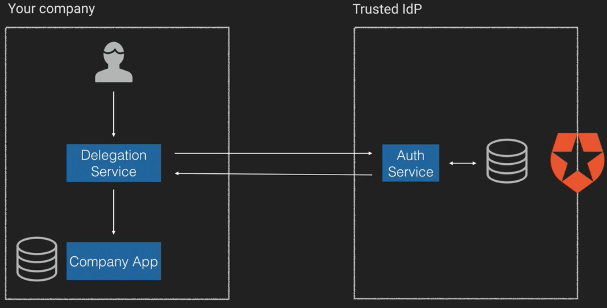

# OAuth 2.0

OAuth 2.0 is an authorization framework that was was built from the ground up based on the existing OAuth 1.0a, and is now widely used by services like Facebook, Twitter and LinkedIn.

Note that it is **not** for Authentication, **not** for Authorization, and **not** for Federation. Instead, it **is delegation for Authorization**. It enables applciations to obtain limited access to user accounts.

The end result uses an access token, like the bearer method in normla HTTP Authentication. So your header might look like:

```
"Header": {
  "Authorization: Bearer <access token>"
}
```

## Federation vs Delegation

What is federation? **Federation** is an authentication process that allows a security token service (or STS) to provide authentication information to another STS.

In practice, this means you establish a trust agreement with one or more third parties identity providers and use them for authentication. It's a type of SSO, where the actor spans multiple organizations and different security domains.

In practice, your company would have a federation service that would direct, say, your employees to a third party they have an account with. Your user would login there, and the identity provider would then return the *authentication* data to your app, which would  then *authorize* your employee.


**Delegation**, instead, is the process of delegating the task and responsibility of *authentication and authorization* to a third party. In this scenario, you don't need to manage any identity access.

In this scenario, the 3rd party holds all the identity information on your users, as well as the information on all the roles they can perform. They are also the only trusted identity provider for your application.

When a user wants to login to your system, they'll be sent to the identity provider and asked to authenticate. They authentication provider will the give them authorization in the form of a token, allowing them to access your company's app.



## OAuth 2.0 Terminology and Behaviour

There are 4 main topics we'll cover off with regards to OAuth 2 here. They are:
* Roles - Different actors (entities) in the OAuth Process
* Grants - Mechanisms of authorization
* Tokens - Actual tokens passed between the client and 3rd party for a variety of purposes. Think of these as essentially random strings with a purpose
* Scope - A group of permissions authorizing what a client can do.

### Roles

There are 5 main roles:

* **Client** - The application trying to access the user's account
* **User Agent** - The agent used to access the client, typically the browser. This typically only comes up when you're talking about single page applications.
* **Resource server**, The party that has the information the user is trying to access.
* **Authorization server** - The server that asks the user to authorise or deny the request. This can be in a whole different ecosystem to the resource server. To make this more secure, the client usually needs to register with the authorization server in advance.
* **Resource Owner** - The party who can authorize the client, to access the resource server. Typically owns the data the client is trying to access.

### Tokens

There are 3 tokens in OAuth 2.0:
* **Access Token** - Credentials used to access protected resources.
  * It represents an authorization issued to the client.
  * Specifies scopes and duration of access.
* **Refresh Token** - Credentials used to obtain an access token when one expires.
  * It is only ever used to talk to the authorization server
  * Optional, usually issued when the access token is issued.
* Authorization Code - Random code sent to the Client
  * Prevents exposing codes to the User Agent.
  * Usually exchanged for an ID token and/or an Access Token

### Grants

A grant is a credential representing the resource owner's authorization to access its protected resources, and is used by the client to obtain an access code.

The client always gets the access key to access the resource server.

There are 4 types of grants, or grant flows, that we'll be looking at in this note:
* Client Credentials Grant
* Authorization Code Grant
* Resource Owner Password Credentials Grant
* Implicit Grant

#### Client Credentials Grant

Highest amount of trust between authorization server and your app. Its usually used for machine to machine communication, and its appropriate when the client can:
* The client can keep the secret confidential
* User authentication is not needed
* The client needs to access a third party resource

In this model:

1. The client passes its credentials (e.g. a username and password) directly to the authorization server. 
2. The authorization server validates this information and sends back an access token (and potentially a refresh token). 
3. The client can then talk *directly* to the resource server (say, an API), and be granted access with its access token.


#### Authorization code grant

This is optimised for confidential clients. You'd use it for web apps on the same server, or for native desktop or mobile apps (though there's an extra step there we won't get into).

In this grant, the end user and user agent don't see the access token, or any other information. You'd use it when you:
* Need to authenticate end users and have the client access their resources.

Note that while, in theory, you could use this for a public client, doing so opens up an attack vector, and there's another grant type that's more appropriate.

In this model:
1. The web client initiates the authentication grant by sending a client identifier to the authorization server via the user agent. It also sends through its requested scope, local state and a redirect url.
2. The authorization server then asks (via the user agent) the resource owner (say, a user) to validate the permissions of the client.
3. If they approve, the authorization server uses the redirect URL it got in step 1 to redirect the user back to the web app, with the local state it was passed, and an **authorization token**
4. The client can then send this authorization token and the redirect url it was generated against to the authorization server to request an access token and (optionally) refresh token.
5. If the authorization server validates the code and redirect url, it returns an access token and (optionally) refresh token to the client
6. The client can use these to access the resource server.

Note that because the client has a refresh token, it can request another access token directly from the authorization server.


#### Resource Owner Password Credentials Grant

This should only be used when the resource owner trusts the client.

Its best to use this when the client is on a different server, but is trusted with the user credentials.

You'd use it when:
* You need to authenticate end users and have the client access their resources

In this grant:
1. The resource owner (the user) provides the client with the username and password
2. The client then authenticates with the authorization server.
3. The authorization server validates the credentials and sends back an access token and (optionally) a refresh token.
4. The client access the resource server using the acces token.


#### Implicit Grant

In this case, the client has the least amount of trust, and you don't get a refresh token. This is the token you'd typically use when you have a Single Page Application, so its a good one to get familiar with.

In this grant type, the steps are:
1. The client redirects the browser to the authorization server's `/authorize` endpoint
2. The authorization server authenticates the user, and asks the resource owner if they approve for the app to have the requested permissions. (This only happens on the first instance)
3. If this passes, the AS passes a redirect URL back to the user agent, which contains an access token.
4. That redirect url redirects the hosted client to the URL.
5. The hosted client then returns a web page which knows how to handle a web token in the URL.
6. The token is passed to your SPA, and stored either in local storage or as a cookie.
7. The client can then access your resource server.


