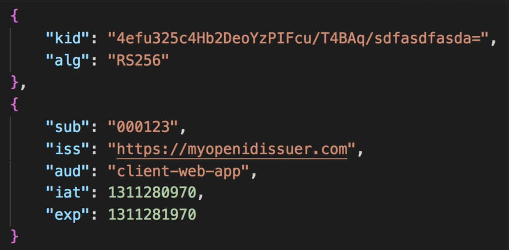

# OpenID Connect (OIDC)

This is an OAuth Extension that defines an authentication and session management mechanism. It adds Authentication and Federation, and returns an **ID token** for providing details about the user in the form of a JWT. The JWT can contain claims, which contain information about the entity.

## Tokens

We now have a new token type:

* **ID Token** - A JWT token that contains information about the end user in the form of claims. Its body usually contains:
  * `"sub"` **(Subject)** - ID of the user
  * `"iss"` **(Issuer)** - IdP that issued the token
  * `"aud"` **(Audience)** - The client ID that the token is intended for
  * `"iat"` **(Issued At)** - The timestamp the token was issued
  * `"exp"` **(Expiry)** - The timestamp for when the token will expire

These are required claims, but you can add more of your own, including scope or the user's name

## Flow Types

OIDC introduces 3 flow types:
* Authorization Code Flow
* Implicit Flow
* Hybrid Flow

We won't talk about Hybrid Flow here, but its used when you need to seperate tokens from the frontend and the backend

### Authorization Code Flow

This has the same use cases as the OAuth 2.0 Authorization code grant, and is very similar, but it adds an extra step.

You don't actually need to request the `access_token` is the client is not accessing resources and only wants the `id_token` for authentication.

Notice that the flow below is very similar to that for the Authorization code grant, though some names have changed. Instead of a client, we have a *Relying Party*, and instead of an Authorization Server, we have an *OpenID Provider*

1. The relying party (e.g. a web app) initiates the authentication grant by sending a client identifier to the authorization server via the user agent, along with its requested scope. That scope must contain OpenID, along with any other scopes you want. It also sends through its local state and a redirect url.
2. The OpenID Provider then asks (via the user agent) the resource owner (say, a user) to validate the permissions of the client.
3. If they approve, the OpenID Provider uses the redirect URL it got in step 1 to redirect the user back to the web app, with the local state it was passed, and an **authorization token**
4. The client can then send this authorization token and the redirect url it was generated against to the authorization server to request an access token, an id token, and (optionally) a refresh token. 
5. If the authorization server validates the code and redirect url, it returns an access token, an id token and (optionally) refresh token to the client.
6. The relying party can authenticate a user and check that they have the required scope before accessing the resource server.

### Implicit Flow

This is based off the OAuth 2.0 Implicit Grant, and once again the relying party doesn't need to request the access token if they only want the id token.

1. The relying party redirects the browser to the OpenID Provider's `/authorize` endpoint
2. The OpenID Provider asks the resource owner if they approve for the app to have the requested permissions. (This only happens on the first instance)
3. If this passes, the OP can optionally validate the user access token and passes a redirect URL back to the user agent, which contains an access token and an id token.
4. That redirect url directs the user agent to the hosted client, along with the access token and id token.
5. The hosted client then returns a web page containing an SPA frontend as well as the tokens.
6. The token is passed to your SPA, which can then authenticate your user using the ID token. The tokens are stored either in local storage or as a cookie.
7. The client can then access your resource server using the access token.

## Validating your tokens

How do we validate our tokens. Well, at a first instance a token would look something like:

We can tell this is an id token because it has a sub.

Where you'll validate these depends on what kind of token it is; you'd validate id tokens on the client, and access tokens on the resource server.

To do this you'd:
1. Check the registered algorithm matches the provided token algorithm
2. Validate the signature or HMAC based on the algorithm
3. Validate the claims based off what you know:
   * `iss`
   * `aud`
   * `exp`
   * `sub` (for id token) or scope (for access token)

If all these things are valid, you know the token hasn't been altered in transit, and can be trusted.