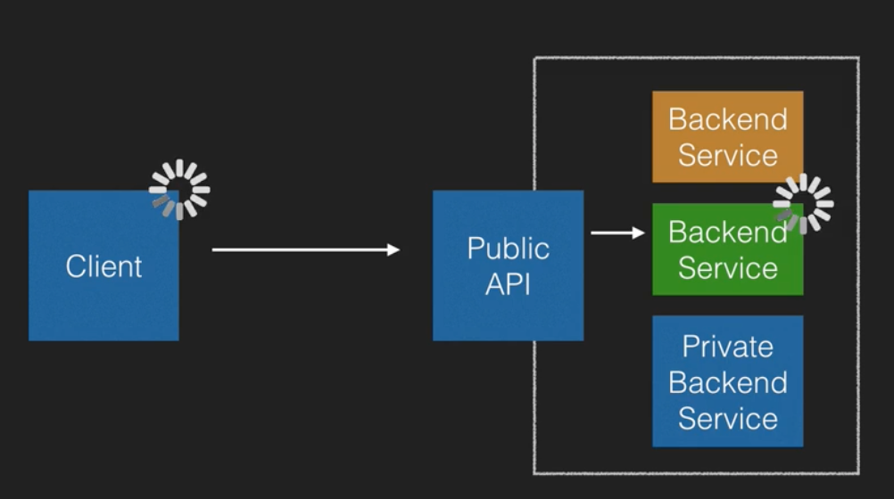

# Serverless API Patterns

In this note, we'll be looking 4 key API patterns.

## API Gateway (Synchronous)

An API gateway is just a service that creates an interface a client can interact with. It is commonly used to provide clients with a single point of access to APIs that, under the surface, have quite complex architectures.

Amazon's appropriately API Gateway service is one example.

The detail that makes this architecture synchronous is that the client is blocking the user from continuing until the API has returned a response from the underlying backend service.

## API Gateway (Asynchronous)

This is the same as the synchronous example above, except that the API doesn't wait on a response from the backend service. Instead (assuming the client needs some kind of response, and this isn't just a fire-and-forget request), it will return a queue or job number that the client can poll.

This system is great when you want to access a service that you know will take a long time to complete an operation, or when you need to retrieve data from a queued job.

## Proxy

This pattern is used when you need a mediator between two systems that can't (or that you don't want to) communicate directly.

Examples of times you might want to do this include when you want to transform some data between the two systems, or when they use different modes of communication (e.g. SOAP vs JSON).

Services that can like a proxy include AWS Glue.

## GraphQL

In this pattern, the client requests what data it wants, and the graph API determines where it needs to go to get the requested information based on registered services.

This is a powerful system that is often used as a layer in front of many different, unrelated systems.

This is great because it gives you a consistent model and interface for requesting information across multiple platforms.

The only service in AWS that provides a fully managed GraphQL system is AWS's AppSync. There are, however, a variety of third party apps that let you build a GraphQL API.

As an example, consider a visitor to a course site, who wanted to view all the courses they've seen. Their request would look something like this:

