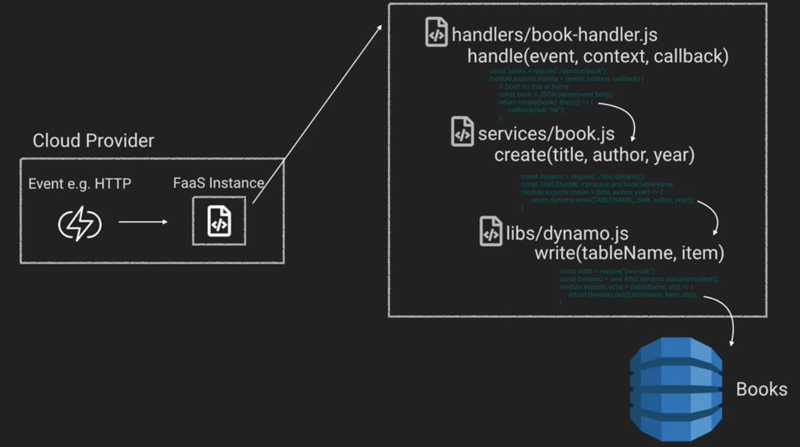
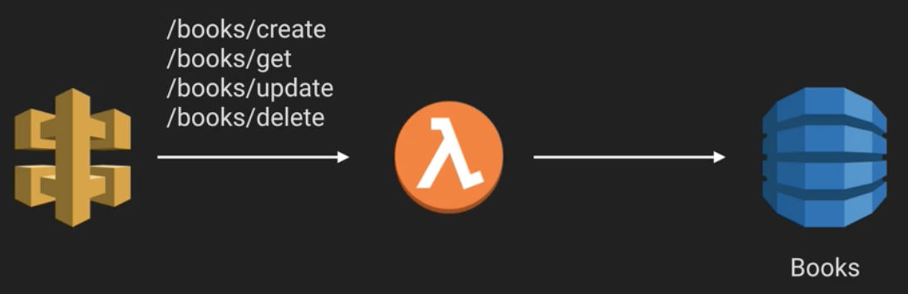
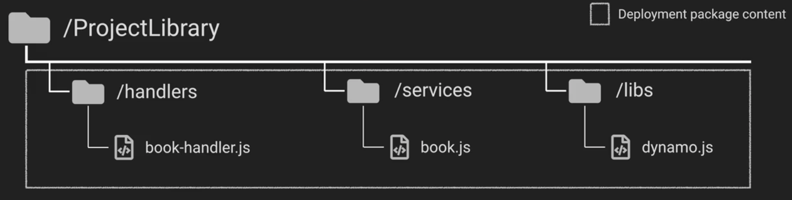
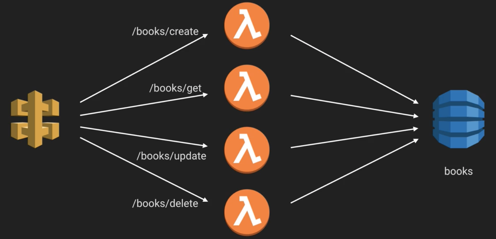
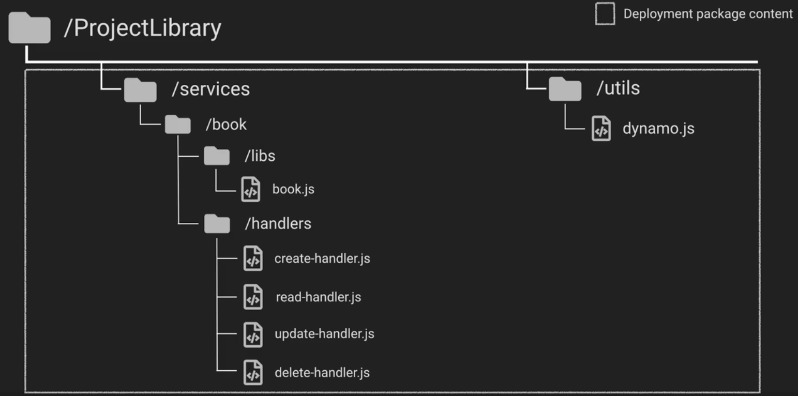
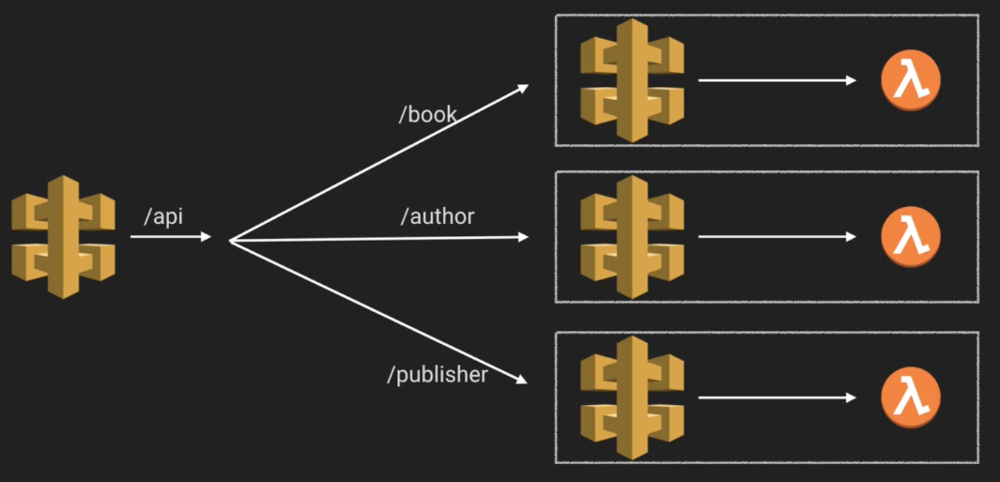
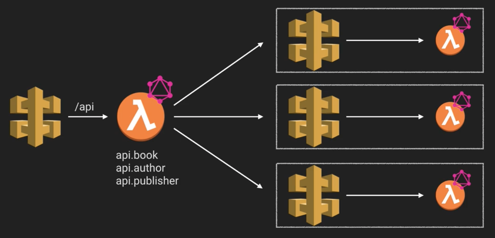
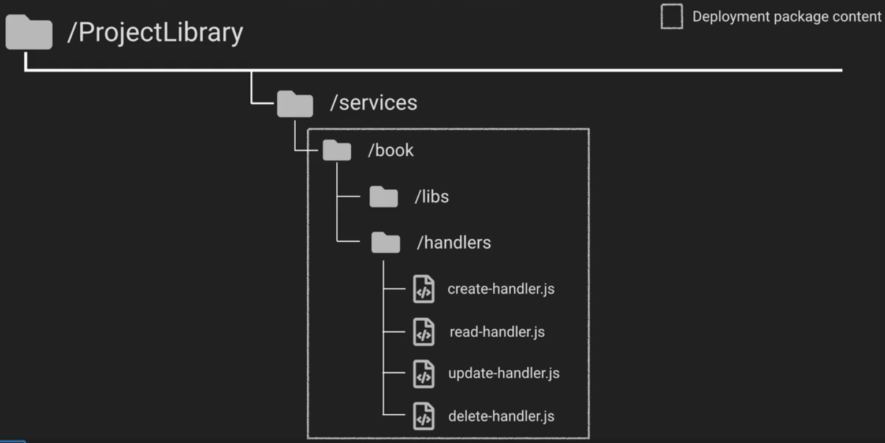
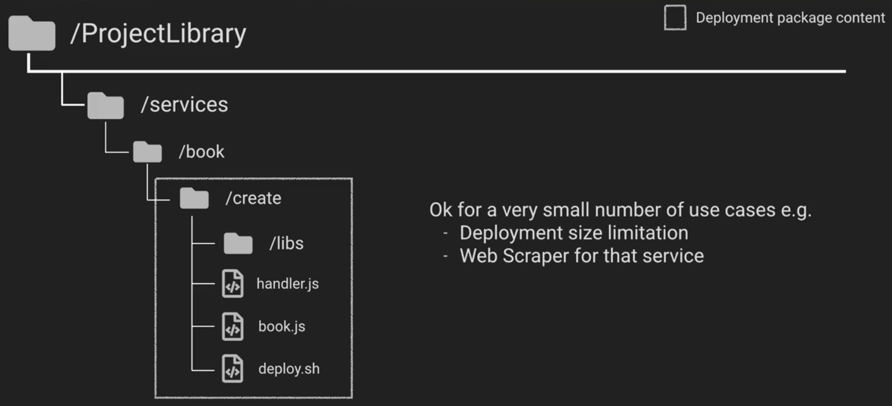
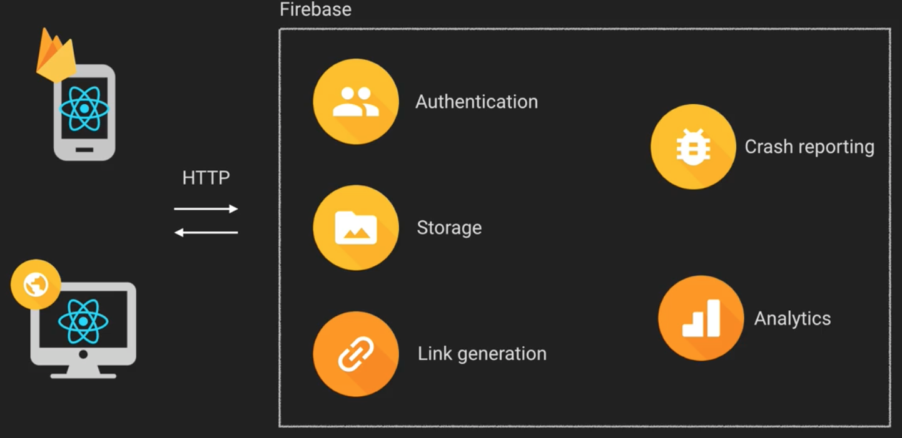

# Serverless Architectures - Backend Architecture

So this topic encompasses a number of potential architectures, that can utilize a wide variety of API patterns. Ultimately, what these patterns have in common is that they aim to expose functionality via an endpoint, usually an HTTP one.

In this note, we'll be covering 4 different common kinds of backend architecture. They are:
* Single function single service
* Multiple functions single service
* Microservices
* Backendless - Third party BaaS providers only

This list is in no way exhaustive, but it should present a good starting point. Finally, also we'll only be talking about CRUD based backends, just to keep things simple.

In addition, we'll also briefly discuss code structure, and in particular seperation of concerns. In particular, these guys recommend having seperate code for:
* Your request handler
* Your service libs, i.e. your application logic
* Cloud vendor service helpers, which are sections of code that help your application logic talk to modules in your third party service provider.

An example of how a standard invocation path might look would is shown below. Having such a clear seperation of concerns has myriad benefits, including improved maintainability and preventing vendor lock in by cleanly seperating sections of your code that interact with the vendor.

## Single function single service

This is a very simple architecture, where your API gateway would wrap all requests for a specific service to a single function. In the function itself, you'd split down the behaviour for each request based on, say, a request param or the HTTP METHOD type.

Note that because you effectively have several different actions encased in a single serverless function here, in some ways this could be considered the serverless equivalent of a monolith, and might event be considered an anti-pattern. As a result, you should typically only use this pattern for small projects.

### Benefits:

* Fewer Files
* High chance of a warm invocation

### Drawbacks

* You can't easily monitor individual actions
* Error in the router function would cause the whole service to go down.
* No nice seperation between the service actions

### Code Structure

Because of how simple this architecture is, the code structure is similarly straightforward. You'd have one function, pointing to project library, and the unit of deployment would actually be the whole project.

## Multiple Functions Single Service

Compared to the previous architecture, this is the one we prefer when building small to medium sized projects.

Your API Gateway would split the requests it received based on method or route to seperate lambda functions. These lambda functions would then all talk to the same database, but would have different levels of access, depending on the actions they needed to perform.

In this approach, each function is based on a particular action. Thus, this is an event-driven approach much more suited for certain architecture. We'd normally also employ a naming convention of some kind (e.g. {service name}-{stage}-{function name}) here to help us group our functions into services.

### Benefits

* Easily integrate these functions into workflows
* Can log and monitor per function
* Easier to test
* Bug in handler doesn't affect whole service.

### Drawbacks

* More functions to manage

### Code Structure

For our code structure here, it would make sense to have 2 different top-level directories, one for services and one for utils, and then break the code down inside them. One potential such arrangement is shown in the image below.

## Microservices

In this architecture, your application has grown quite a bit, and your codebase is starting to get pretty messy.

In this situation, you'd actually have a number of API Gateways. In addition to having one that acts as a single point of entry for clients into the API, you'd also have an API gateway fronting each of the individual services within it. The main gateway would route to these subsidiary gateways based on path.

Each of theses subsidiary services can actually then be managed and deployed on their own.

Another way to operate such an architecture would be to use GraphQL. You would then need to have a lambda function together to stitch the services together and provide a single schema. To create this schema, this lambda function would need to know how to talk to the subsidiary services in order to ask them what methods they had available, and compose all this in a way that makes it clear to the client what it can request.

### Benefits

* Can scale very well
* Concerns are neatly seperated
* Easier to deploy and manage
* Benefits of GraphQL (assuming you're using it)

### Drawbacks

* Service discovery is manual
* An addition or removal of a service means the BFF function will need to be updated
* If the BFF function goes down, the frontend stops working (if you're using GraphQL)

(BFF stands for Backend For Frontend)

### Code Structure

The code structure for such a system closely resembles that of the Multiple Functions Single Service pattern, just that the utilities would need to be folded into your individual functions. You would then deploy your code based on the service.

### Minilith Anti-pattern

Note that there's a catch here that's important to avoid, and that's creating a deployment package per action. This pattern results in a huge amount of additional work, and a lot of duplicated code between deployment packages, so don't put yourself through it.

There are a few exceptions of course. Some examples might include if you're running up against a deployment size limitation (though you have other questions to ask yourself then), or if you're creating a web scraper for that service.

## Backendless

In this architecture, the majority of your application logic is actually stored on your app's frontend, or its mobile application.

Those services then talk directly to a BaaS, which can provide a multitude of services, including:
* Authentication
* Messaging
* Remote Config
* Database
* Analytics
* Crash Reporting
* and more...

Firebase is the classic example of such a system, though interestingly you can also make many AWS services operate in an analogous way by connecting them directly to an API gateway.

### Benefits

* No backend code to manage
* All application logic on the frontend
* Quick time to market
* No cold starts

### Drawbacks
* You're at the mercy of the cloud provider; this pattern provides the largest amount of lock in
* Bulkier frontend, as all the application logic is now there.