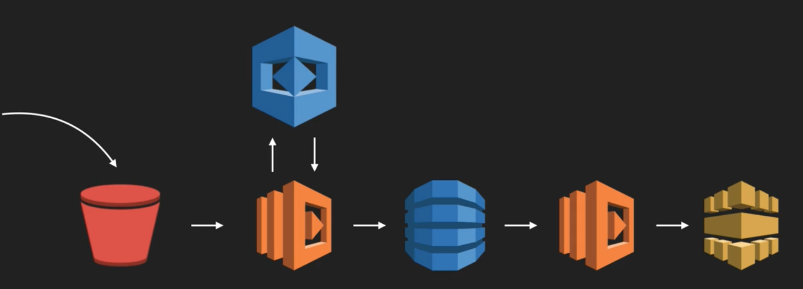

# Serverless Architectures - Compute as Glue

Compute as Glue is potentially the most common architecture in cloud computing.

In this architecture, you use multiple services to create a pipeline with functions as the connectors between services that wouldn't be able to communicate otherwise. It uses the streams/queues pattern, and the pipes and filters pattern.

To connect two services, you need to know both the output of the service that's sending your function information, as well as the input of the service that you're sending the processed information to.

## Image Upload - AWS

As an example, consider an image upload metadata analysis pipeline built in AWS. In this architecture, you'd have:
1) An S3 bucket to which the user uploads a photo
2) A lambda function which retrieve the image from the bucket and sends it to AWS Rekognition to get the objects from the image.
3) That same lambda function would then receive the results from Rekognition and upload them to a DynamoDB table.
4) A second Lambda function would then monitor the Dynamo DB stream, and on a new addition, would add that data to Elasticache to allow easy searches.

## Logging and Alerting Commits - GCP

Another example would be to monitor Github commits using GCP. You could use a cloud function to monitor commits to Github and save the results to a Firebase real-time database. You could then use another cloud function to monitor the changes to that database and post appropriate messages to Slack.

