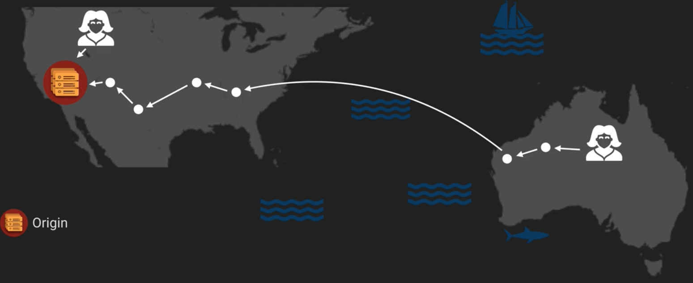
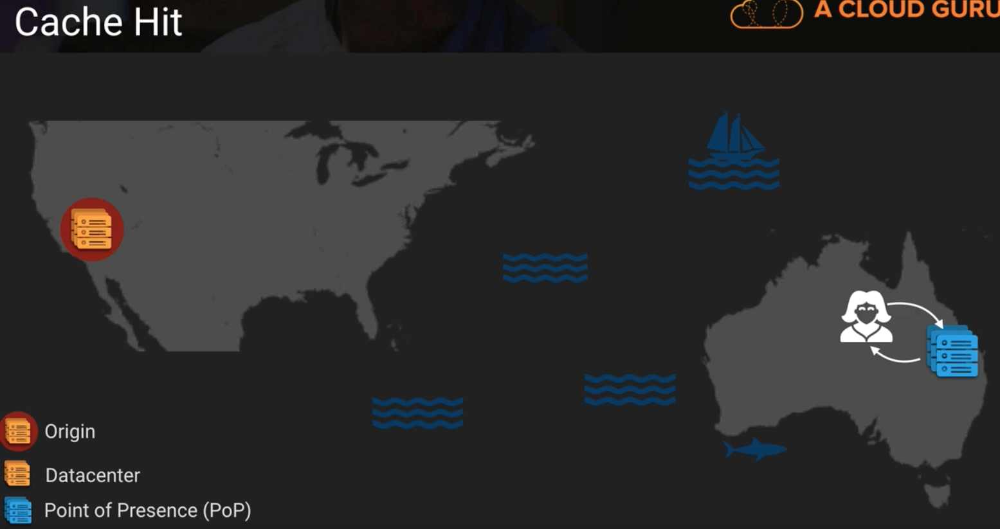
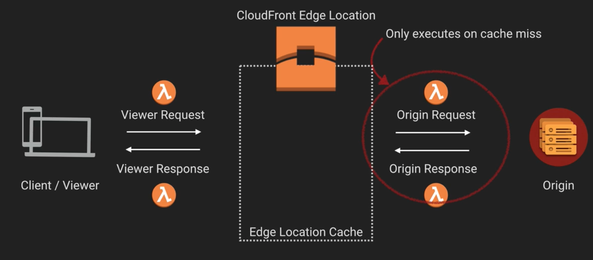
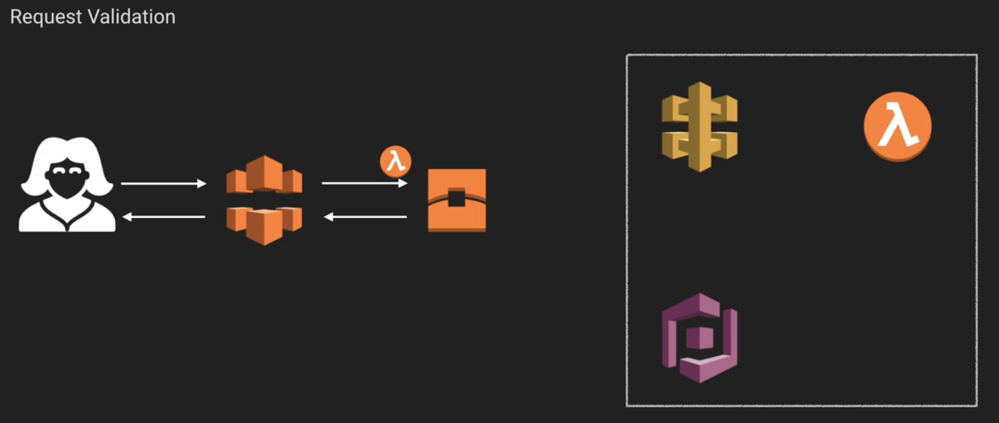
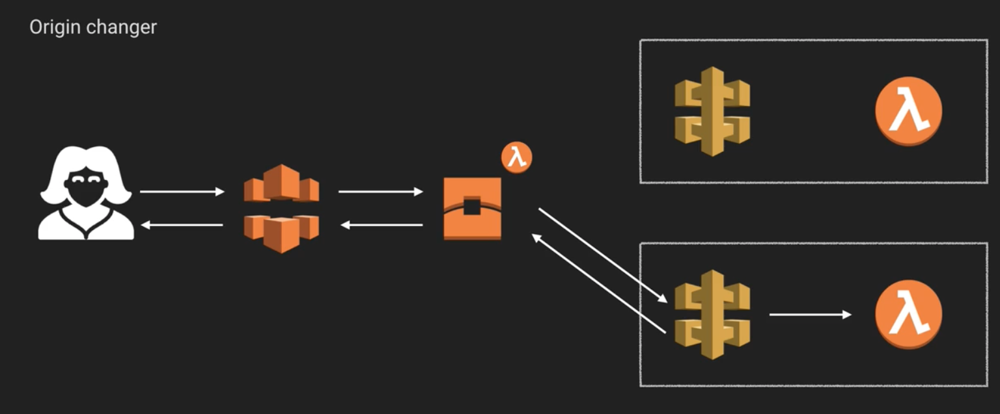

# Serverless Architectures - Edge Computing

In this note, we'll quickly look at edge computing and in more detail at functions at edge.

In most contexts, when people think of edge computing, they think of IoT. In such a world, you'll typically have a number of independent devices we'll call **things**. These all typically have their own microprocessers, kernels, and formware to let them communicate both with each other and with **edge devices**. An edge device is an item that's designed to communicate with your things over the local network. That edge device can then communicate with the **cloud**.

A simple example of all of this in action is Hue lights. You buy a number of lights, for your rooms, but you also need to install the Hue Bridge. When you actually set up a Hue account then, it communicates with your lights via the bridge via the cloud.

## Functions at Edge

This stuff all works great in the context of IoT, but what if you just want to do some application development? Welcome, functions at edge, which is less a specific service, and more a combination of serverless and CDN Edge Locations.

**Edge Functions** are functions located and run at an edge location (or point of presence) closest to the user. They can allow you to manipulate/rewrite/redirect requests or responses. You can also access third party services.

At the moment, the only cloud provider that provides functionality like this is AWS, via their Lambda at Edge service.

## Performance

The main reason to use functions at edge is the increases in performance. The reasons for this should be pretty clear, as they're identical to the reason CDNs and Edge Locations are part of AWS in the first place. I.e., if I make a request to an American origin server from Australia, I'll have to make a number of hops:

On the other hand, if there's a point of presence near the Australian user then you can request data from that. If it's the first time it's requested, it still has to go to the origin server. However, if it has the data cached, you get a much faster response.

## Lambda at Edge

All lambda at edge does is allow you to run small pieces of logic against your request and responses before or after they hit your origin server. You have 4 entrypoints to do this:

A simple example of this stuff would be to have a function at edge validating your JWT when authenticating your user. If the JWT is valid, you don't get as far as your API.

Or say you have an origin changer, which routes your user to different APIs depending on their geographical location.

These are just 2 of many uses of functions at edge. We're always discovering more, so keep your eyes open.