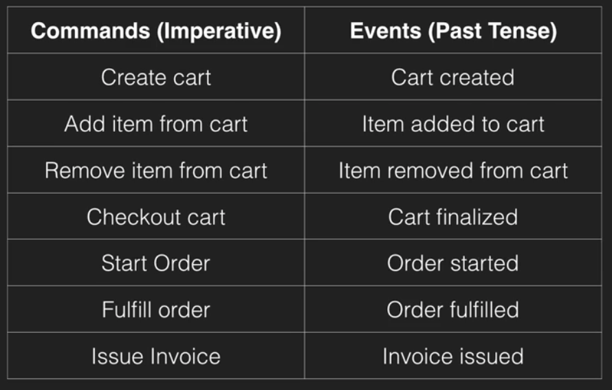
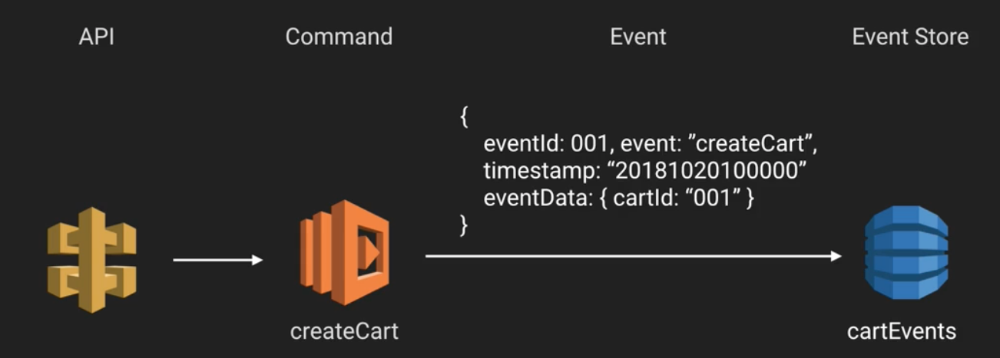
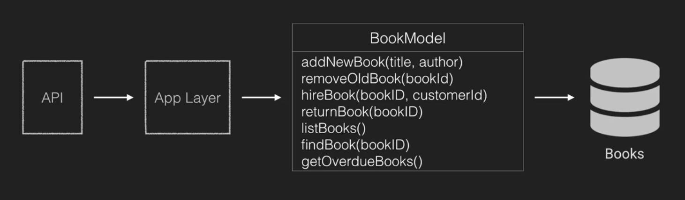
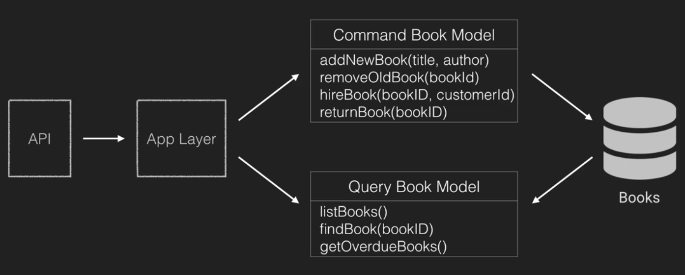
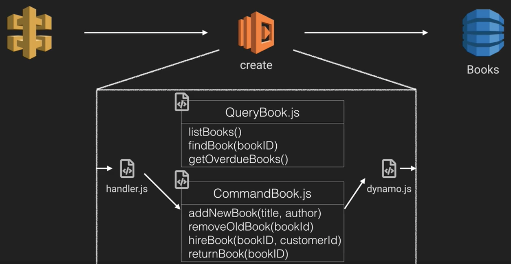
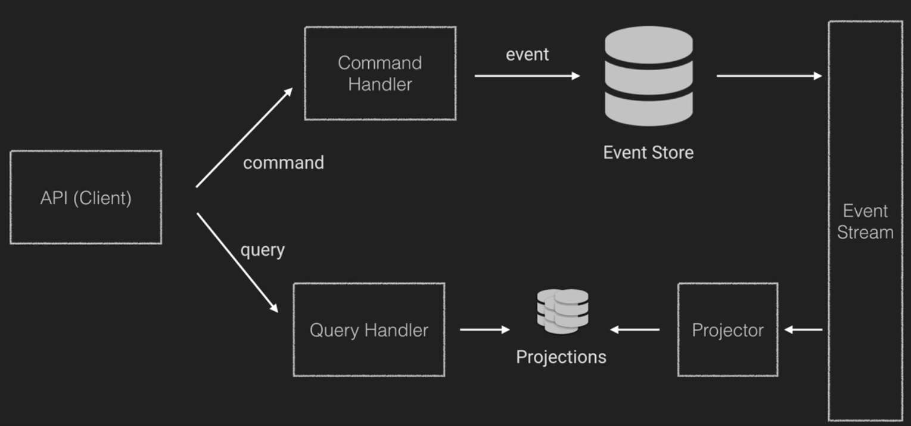
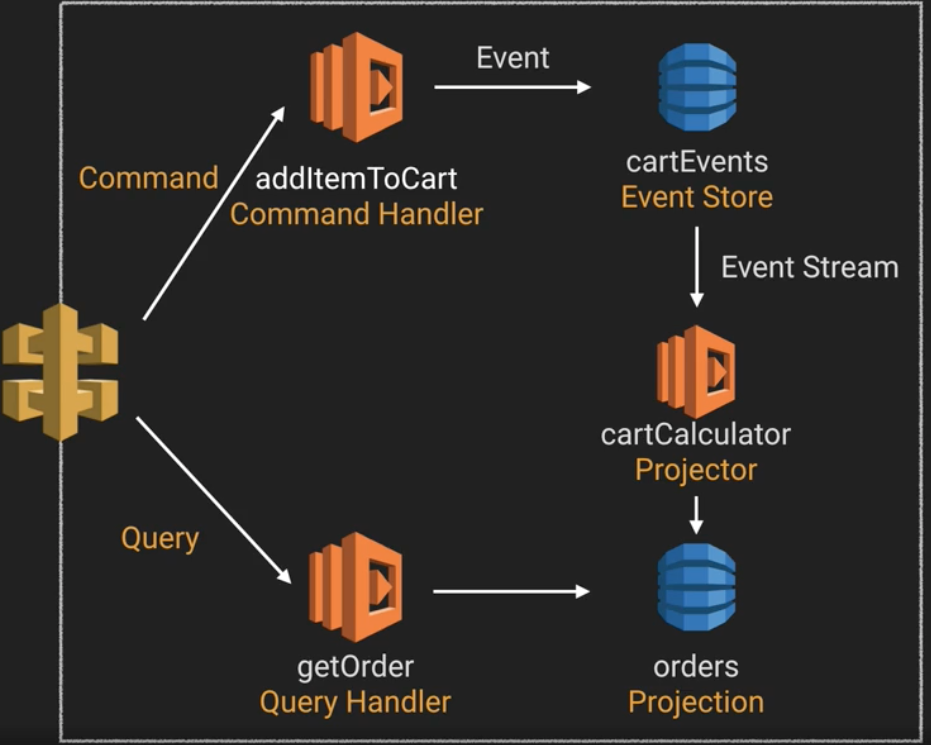
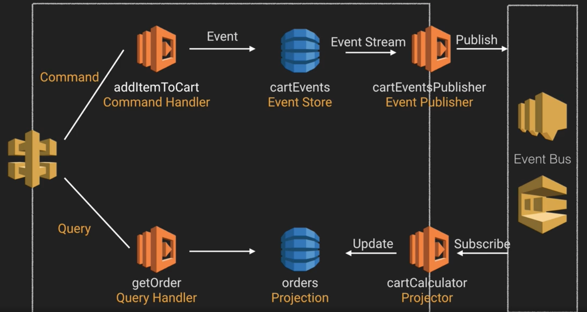

# Serverless Architectures - Event Sourcing and CQRS

In this note, we'll be looking at event sourcing and CQRS. These are actually two seperate concepts that just so happen to work very nicely together, and so are often lumped together when they're being discussed. In addition, they are commonly also paired with Domain Driven Design, or DDD, which we won't be covering here.

The other thing to note here is that this isn't a top level architecture. If you have an API that is bounded up into tangible services based on business domain, you might find that only one, or even none of the services will benefit from these techniques. As ever, remember that architecture is not a one-size-fits-all tool.

## Event Sourcing

The key motivating thought behind event sourcing is that rather than saving the current state of an object, you instead save every single event that happens on a particular entity in your system.

Crucially, you never want to lost data, as you don't know the value of the data, and can't predict its value in the future.

There are 3 main components in event sourcing. They are:
* Commands
* Events
* Event Store

### Commands

Commands are *client intentions* to change some data. They tend to represent user actions that occur (rather than, say, HTTP actions), are imperatively expressed, and are handled by a *command handler*.

For example, if we had a shopping cart entity, actions we could take on it might include adding and removing items, or checking the cart out.

### Events

Events represent facts about something that has happened from a command.

In event sourcing, events are both immutable (can't be changed) and immortal (can't be removed). They are also self-described business facts, and so tend to be expressed in the past tense, and are denormalised because you don't know the structure of the data you want.

In the context of our shopping cart, where a command might be "Add item to cart", an event would be "Item added to cart". Notice the distinction in tenses.

## Event Store

This is the data store for your events. Its append only, and stored sequentially, because this allows you to create a story which leads to the final state of your system. Changing the order of events in the system could change the final state.

### Facilities of Event Sourcing

Event sourcing provides us with a number of interesting facilities in our applications. These include:
* **Complete Rebuild** - The ability to build application state by re-running the events from an event log
* **Temporal Queries** - This allows you to determine what the application state was at any point in time, and build up multiple timelines of events. Temporal queries are also very useful, because they allow you to examine historical data and perform analytics on your system's state.
* **Event Replay** - This allows you to fix issues with event ordering or incorrect events by replaying the events in a different order and observing the consequences.

### Architecture

The simplest version of an event sourcing architecture is very simple indeed. All you need is an API, a Lambda function which receives the command, and an event store which saves it (e.g. a DynamoDB table). 

### Projections

Unfortunately, event stores are *terrible* for reads. And yet, of course we want to get current data, or the derived current state from our system. This is called a **projection**.

Projections are created and updated from **projectors**, which listen to an event stream from your event store, and form a read model for queries in your application that can present the data in many different structural representations, depending on what you need.

### Benefits

* No object to table mapping to manage
* Better reporting because you've preserved your history
* You can reconstruct past states
* You can rebuild databases

### Drawbacks

* Upgrading events (e.g. changing their schema) is difficult.
* You'll need code to manage updating events
* Storing a lot of event data
* Requires a mental shift
* Quite difficult to implement correctly
* You need a query strategy.

### Use Cases

Circumstances in which you'd use an event store include cases where:

* You have a lot of non CRUD behaviour
* You need accountability
* You need version control on your data
* Your domain is itself event driven
* You need temporal queries for business decisions

## CQRS

CQRS stands for **Command Query Responsibility Segregation**. In essence, this pattern is about seperating writes (Command) and reads (Query) in your models.

This can also be splot across two databases, e.g. a write database and a read database (a.k.a a View or Projection).

Why might you do this? Well, one circumstance might be when you have a lot more reads than writes, and you want to decouple the two pieces of functionality so you can scale them independently.

### Example Implementation

A simple example of this would be to consider a basic bookshop API, with a number of potential actions.

In a CQRS model, we'd split the `BookModel` into two models, one for commands, and one for queries.

In a serverless setting, we'd already be breaking our CRUD operations out into different lambda functions, so the top-level architecture wouldn't actually need to change. However, under the hood, the functions responsible for Create, Update and Delete would use the Command model, while the function for Read would use the Query model. So for example, a create function under the hood could look like:

### Benefits

* Separate model for Command and Query
* Optimise reads and writes seperately

### Drawbacks

* There is a learning curve
* Not many use cases compared with the CRUD mental model, so it should be used sparingly, where appropriate.

### Use Cases

* You have a disparity between the number of reads and the number of writes
* Performance is critical to your application
* You have complex business logic that a CQRS model actually helps to simplify.

## Putting it all together

When thinking about putting event sourcing and CQRS together, its important to remember that they have different considerations:

* Event Sourcing is concerned with how you store your data and generate state
* CQRS is concerned with how you seperate your read and writes

In addition, its also important to remember:

* Clients that interact with your app are interested in its current state
* Event stores are terrible for current state

### Example Architecture

By putting the two systems together, you can deal with a system that deals with these concerns pretty handily:

In the architecture above, commands send events to the event store, which effectively becomes a write-only database. An event stream looks for changes in that system, and publishes those messages to whoever needs to know, in particular, a projector. This projector then grabs the data and adds it to its projection(s). These projections are what the query handler will query when a read request is received.

The simplest version of what that architecture might look like in AWS would be:

A more advanced version of this architecture could add an event bus, which would allow you to publish the changes to the event store more widely throughout your architecture.

### Benefits

* Maintain every change
* Can generate new projections for new looks at the same data
* Better reporting
* Allows you to scale reads and writes independently

### Drawbacks

* Eventually consistent - It takes time for data to propogate through your system
* Upgrading events is difficult
* Requires a mental shift
* Race conditions with consumers
* Event contracts for consumers