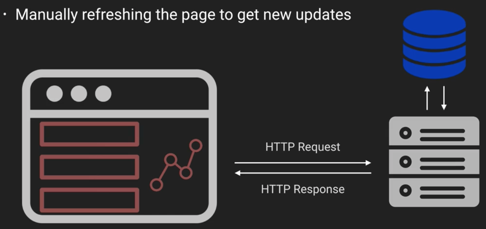
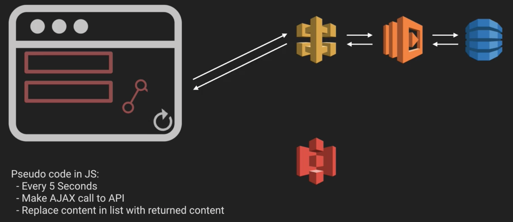
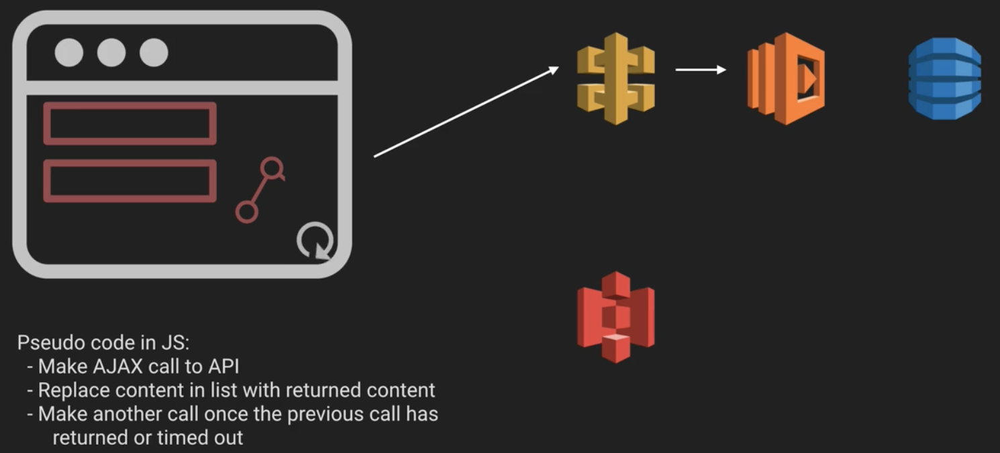
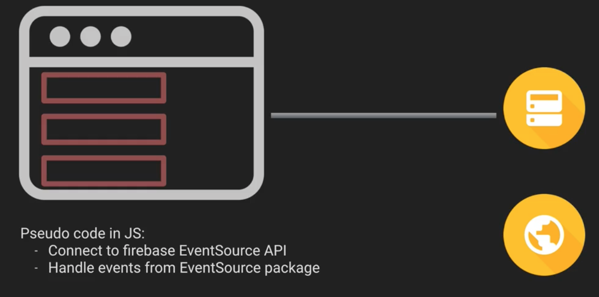
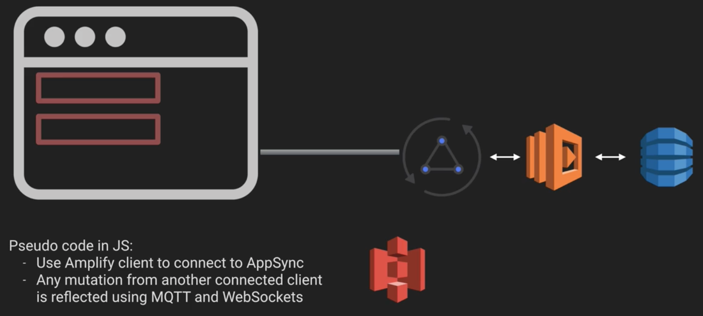

# Serverless Architectures - Realtime Architectures

In this note, we'll be looking at various realtime architectures. However, before we do that we'll need to understand some terminology that's common in the field. In particular:

* **Half-duplex** - This means unidirectional messaging; messaging one way.
* **Half-duplex** - This means bidirectional messaging
* **Protocol** - This is the set of rules that people use to communicate. The most commonly known one is HTTP.
* **Comet** - Which focuses on two way realtime communication

## Web communication methods

We'll be looking at 5 different communication methods commonly used in the industry. They are

* HTTP Request Response
* HTTP Short polling
* HTTP Long polling
* HTTP Server Sent Events (EventSource)
* WebSockets

## HTTP refresh

This is literally manually refreshing the page to get new updates.

Of course, this isn't a particularly dynamic way to refresh content on your page. One way around this is to make AJAX (Asynchronous Javascript And XML) calls to make HTTP requests behind the scenes without refreshing the page.

## HTTP Short Polling

This method involves creating a frontend script which continuously grabs updates from the server and returns those results instantaneously.

This is a half-duplex, or unidirectional, call because only the client can call the server, not the other way round. One of the benefits of such a system is that its over HTTP, and thus supported by all browsers.

The biggest issue with this method is the sheer volume of calls you're making to your API. You continue to make these calls even when there hasn't been any change in the information, because as the client you have no way of noticing when a change should occur.

## HTTP Long Polling

A way to solve the "many requests" issue with HTTP short polling is to use HTTP long polling. In this scheme, you still have a frontend script which polls the server, but now the server holds onto the request, and doesn't reply until there's been a change.

If there's some kind of timeout to the request, the website can make another call after the first request times out.

Once again, this is a half-duplex, or unidirectional call, because only the client can initiate this process. Once again, its also over HTTP.

The downfall here in a serverless setting is that you're making long-winded calls to Lambda functions, which is not what you're supposed to do. It's far more appropriate in serverful applications.

It'd also be nice to just be notified of a change whenever its happened, rather than having to constantly poll for it.

## Server-Sent Events (Event Sourcing)

In this method, the server sends events to the client when something has changed. The system is still half duplex, but this time its the server connecting to the client.

This is actually pretty simple to use, and is still sent via HTTP. It also comes with some interesting additional features like automatic reconnection and eventIds, has reasonable support in new browsers, and has poly-fill support for older browsers.

Examples of situations where you might use it would be social media feed updates, notifications to users, or stock or crypto price changes.

In the serverless world, this is another pattern you don't see much, because it depends on a server that isn't short-lived like a Lambda function is. On the other hand, you do see it in services like Firebase.

## WebSockets

Finally we come to web sockets, the only full duplex, bidirectional connection type on this list. With web sockets, a connection is made from the frontend to the backend using an open socket connection which allows for the connection to remain open while data is passed back and forth.

This means you're no longer using HTTP, but instead are using a single TCP connection, which means you don't need to send the same headers and cookies all the time.

Messages are sent as multiple frames, and reconstructed at the other end to reduce latency. In their implementation, they're quite similar to the Pub/Sub pattern.

Now, these are a lot harder to implement then EventSourcing, but there are also luckily a number of implementations that already exist.

In the serverless world, web sockets were originally a pain point, again due to the ephemereal nature of serverless function instances. However, the cloud providers noticed this as a pain point, and built services to interact this. They include:
* AppSync on AWS, which is used for GraphQL subscriptions.
* AWS MQTT, for connections to IoT devices
* Google's Firebase, which is client to database
* Websocket client libraries, which we can't use for FaaS

An AppSync architecture might look like:

