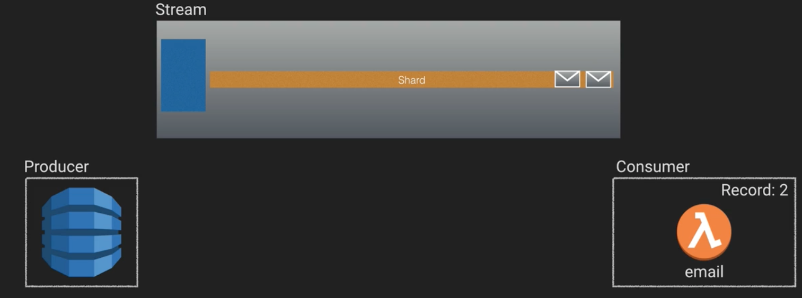
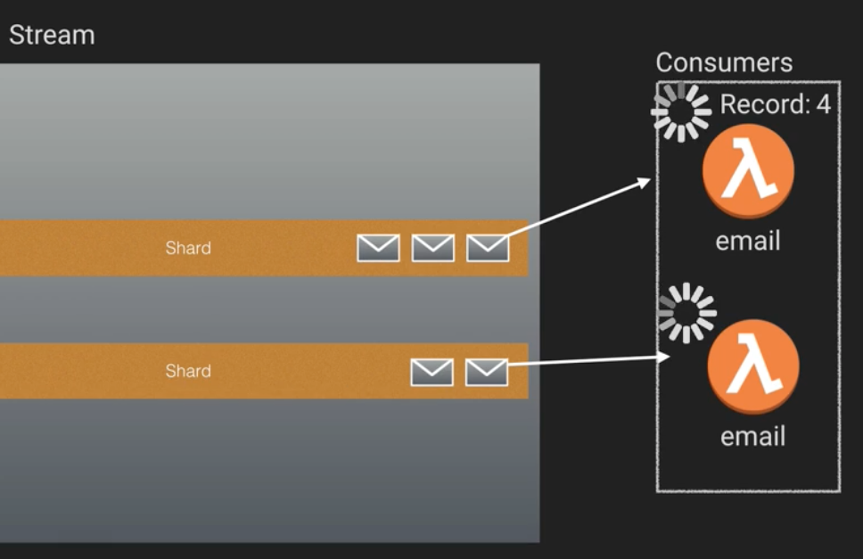
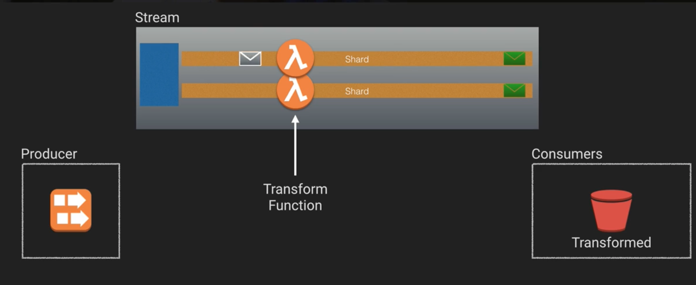
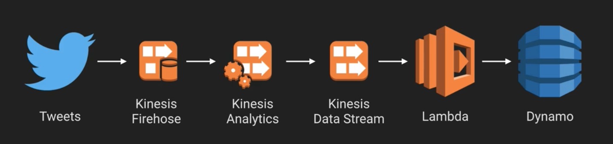

# Serverless Architectures - Stream Processing

In this note, we're going to take a look at stream processing in a serverless context. 

With the processing of streams, you get a high ingestion of records, with a low latency time for their processing. This allows you to simulate near real-time analytics. 

Messages stored in streams are durable, and are not removed from the stream after they're processed. They also have a lifetime. Typically, that's 24 hours, but it can be customized.

Streams are great to use when you want to decouple your application from the large amounts of data you're injesting. The specific architecture you'd use in such a system depends on the specific use case.

## Stream Components

There are several types of component key to streams that we need to be aware of. They are:

* **Producers** - Items that produce records that are added to the stream. These can be any source of data, from mobile apps to system logs to more besides.
* **Consumers** - Items that read records from a stream. Typically, these are data processing or storage applications.
* **Shards** - The basic unit of scale for streams. A single shard is capable of injesting up to one megabyte of data per second.
* **Records** - The unit of data stored in the stream. Typically they have a maximum size. The partition key in the record allows you to identify which shard it came from, and it allows producers to distribute their load across shards.

The image below shows a simple example of such a system.

### Multiple Shards

Having multiple shards allows you to increase throughput through your stream, because each shard can individually send messages to the consumer, and because that consumer is serverless, its a simple matter for it to scale up new instances to handle the increased throughput. Note though that even though shards themselves are FIFO, in the presence of multiple shards concurrently calling to consumers, you cannot guarantee that the ordering of messages across the stream will be maintained.

Note also that while this might look like a push-based system, in actuality what's happening is that lambda is polling the stream. This, however, is all managed for you.

### Stream Transformations

There are also a stream tranformation services available. When a message goes onto the stream, these services transform that message before returning it to the stream. Each shard gets its own instance of the transform function.

## Stream Services

Each of the major cloud providers has their own stream provider, and they all behave a little bit differently. To be more specific:

* AWS - Kinesis
* Azure - Stream Analytics
* GCP - Cloud Dataflow

In AWS, you have a number of sub systems which allow you to stream. These include:

* Kinesis Data Streams
* Kinesis Firehouse
* Dynamo DB stream
* Kinesis Data Analytics
* Kinesis Video streams

## Benefits

* Allow you to have producers and consumers operate at different capacities
* Allow you to ingest and process large amounts of data in short periods of time.
* Streams can be processed to transform data into meaningful contexts.
* Records are maintained in a stream for a set amount of time.

## Use Cases

* Archival/Auditing
* Notifications/Messaging
* Real-time Analytics

A simple example of a twitter based real-time analytics is shown below:

## Gotchas

* Lambda account concurrency limit
* Maximum of 2 process reads per shard
* Pay per shard hours
