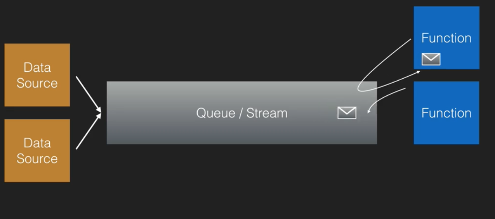
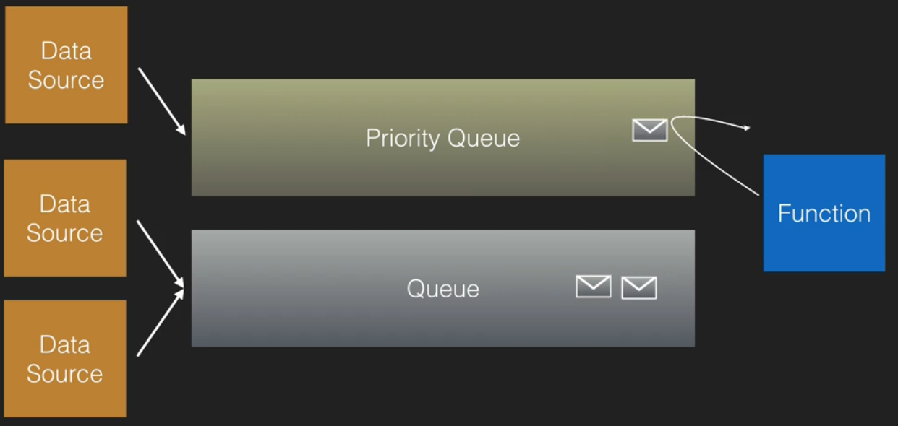
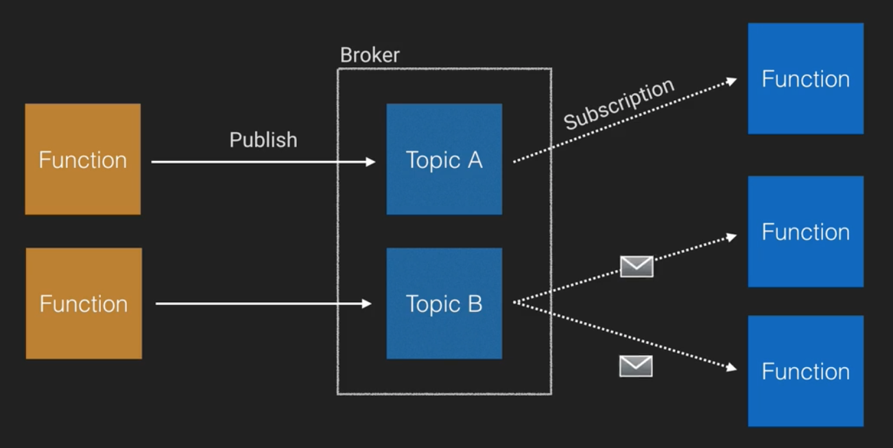

# Serverless Messaging Patterns

In this note, we'll look at 3 basic messaging patterns.

## Queues/Streams

This pattern allows us to store events/records/requests in a queue for later asynchronous processing.

This is a highly reliable pattern, as if the consuming service goes offline, messages can are retained in the queue until it comes back online, when processing can continue.

Using this pattern decouples your application and supports the fan out pattern. As such, they're an ideal pattern when you're building a decoupled arrchitecture, or need a highly reliable messaging system between your services.

In AWS, SQS and Kinesis can provide these functionalities. Now, one is a queueing system, and one is a streaming system, which are very different beasts. However, conceptually, they are similar enough to be considered together here.

Note that this system is **pull-based**: the functions here poll the queue, and there is no concept of push. You need to pay for all of those requests that are made.

## Priority Queues

Priority queues are very similar to the previous pattern, the difference is that you can now apply a priority to your messages, to indicate that they need to be processed at the earliest possible interval.

There are a number of ways to implement this pattern. One is to have a priority applied to the messages themselves, which controls their position in a single queue. Another is to simply have a seperate queue for "high-priority" items, which simply has its items handled first. An example of this second type is shown below.

An example might be when you have a simple system to convert video files that operates a premium and a free tier. Premium videos requests would be processed first.

## Pub / Sub

In this pattern, we have 3 pieces of terminology we need to understand:
* **Publisher** - A component which publishes messages into a topic
* **Subscriber** - A component which receives messages for a particular topic
* **Broker** - A component that manages the communication between publishers and subscribers.

This is an excellent model when you need real time messaging or you need to fan out or add decoupling to your application.

Services that offer this for you in AWS include their SNS, IoT and AppSync services.

Note that this is a **push-based** system, where the subscribers need to register with the broker to receive messages. Note also that when the broker receives a message, is pushes it to **all** its subscribers. Thus, systems like this are commonly seen in real-time messaging (think a group chat on Whatsapp), and IoT where you have millions of devices publishing and subscribing to messages.