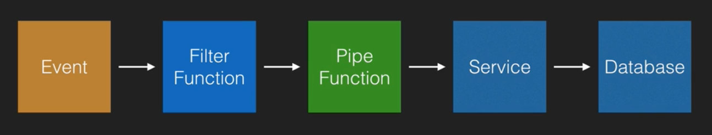

# Serverless Orchestration Patterns

In this note we'll look at 5 common Serverless 

## Pipes and Filters

In this pattern there are a few bits of terminology to get down:
* **Pipe** - A component that passes information between systems
* **Filters** - A component that transforms data

The goal of this pattern is to break down any complex task into a series of simple independent tasks that strictly adhere to the single responsibility principle.

You'd use this pattern when you have a discrete, reusable function that is repeated fairly frequently, or if you needed to connect something together.

An example in AWS would be their Glue system, or even just your standard AWS Lambda functions. Note that in this pattern, you don't necessarily need to use functions, the pipe could as easily be a service that saves to a database.

A concrete example might be scraping information from a website. You could trigger the function with an API call, scrape the data from the website, transform it with a filter to something useful, transform it again to get what you can use, and then pipe it into a database.

## Command Pattern

In this pattern a function chooses what action to take based on the received data or event. In this pattern, you need to know the functions you can trigger in advance, as well as the routing logic to route your requests.

The goal of this pattern is to decouple the caller of the operation from the entity that carries out the process.

Thus, you'd use this pattern when you want to decouple the caller and the receiver, or when you need a single entry point with multiple outcomes.

A real world example of this might be a third party payment system that regularly checks a user's transactions to see if their subscription is up to date. If it is, you grant access. If not, you deny access to your palatform.

## Fan Out

This pattern allows you to trigger multiple tasks in response to the same event. This enables the use of concurrency, and is used a lot in messaging patterns.

You'd use it when you need several independent tasks to be performed based on the same event.

There are plenty of systems that allow you to do this. Two examples include Amazon's SNS and Amazon's SQS.

A real example might be as simple as registering a new user to your system. They send a single registration POST event and you need to complete a variety of tasks, including writing their data to your database, sending them a verification email and adding an analytics stream to enable you to track their usage of the platform.

Note that in that example though, there is a dependency you need to think about, namely you want to ensure you've successfully saved the user's data in your DB before you perform the other tasks, so your system might actually look a little different:

## Fan In

This pattern, in contrast to the previous one waits for a number of concurrent tasks to finish before continuing. As a result, you may need to manage state for all the tasks you're tracking.

You'd use this pattern when you need to trigger an action after the completion of several other independent tasks.

An example of this on the ACloudGuru website might be the uploading of an AWS certification. Their website needs to complete a series of tasks when this occurs, including creating a thumbnail, extracting text from the certificate, and validating any past uploads. Once all these tasks are completed, the site can send you an email confirmation.

## Step Orchestration

This final orchestration pattern allows you to orchestrate a number of tasks from previously added functionality to build a pipeline. 

Additionally, it allows you to utilise more complex functionality, including:
* Plugging and swapping functional blocks
* Error Handling
* Using logical flow steps like loops, conditional paths, wait steps, branching in, branching out, etc.

Services that allow you to do this include AWS Step Functions, and you'd do this when you wanted to manage more complex flows, or didn't actually have the coding skills to do all this stuff in code.

An example might be creating a Raspberry Pi security camera.

